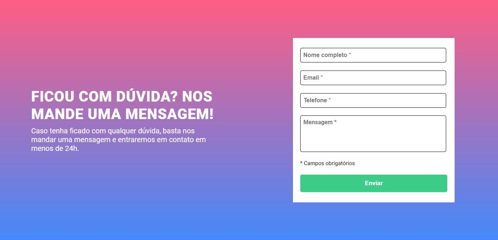

# Quest de JavaScript Intermediário

Atividade feita durante o curso DevQuest, dos irmãos Ricardo e Roberto (<a href="https://www.instagram.com/devemdobro" target="_blank">@devemdobro</a>).

## Screenshots

### Desktop

### Mobile

## Tecnologias utilizadas

- HTML
- CSS
- JavaScript

## Coisas que aprendi

- Manipular elementos HTML através do JavaScript (DOM);
- Trabalhar com funções, condicionais e laços de repetição no JavaScript.
